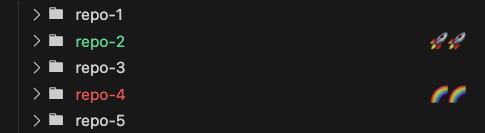

# folder-colors

A small VS Code extension to set custom colors and badges for folders in the explorer.
It helps me spot some important repositories when I have a long list of repos in the current folder.

## Features

In the settings, add the folders you want to highlight:
```
    "folder-colors.settings": [
        {
            "name": "repo-4", "color": "terminal.ansiBrightRed", "badge": "🌈🌈"
        },
        {
            "name": "repo-2", "color": "terminal.ansiBrightGreen", "badge": "🚀🚀"
        }
    ]
```



## Known limitations

When other extensions like the VS Code built-in git integration set a badge on a folder (e.g. to show uncommitted changes) it will override the custom badge.